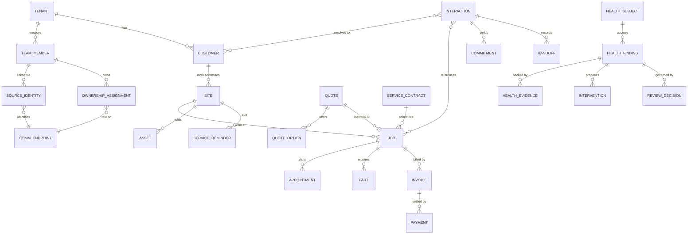

# Canonical Entity & Health Map — Drummonds / ServiceOS

**Status:** design + mapping deliverable (no ingestion built).
**Scope:** how evidence from **Commusoft, telephony, email and Slack** resolves into **canonical ServiceOS entities → Health findings → product surfaces**.
**Masking:** customer names/numbers/addresses/IDs are masked (`<Customer A>`, `CUST-••••`, `JOB-••••`, `+44 7••• ••• •••`). Authorised Drummonds **staff** identities (e.g. Mary Paganga, ext 103) are shown, since the increment is explicitly about them.

## Governing principles

1. **Canonical models are provider-neutral.** No canonical entity depends on Sipcentric, Google, Slack or Commusoft field names. Provider quirks live only in an **adapter/evidence** layer (e.g. `caller_id_labels.ts` parses `Mary - Clients <103>`; the canonical suggester never sees that format).
2. **Reuse before invent.** A Commusoft table is *not* a reason to create a canonical entity. Every proposed entity is checked against an existing ServiceOS model first.
3. **Evidence ≠ identity.** A source label (`Mary - Clients <103>`, a mailbox display name, a Slack handle) is *evidence for a link*, never the canonical identity. Links carry confidence, provenance and **effective dates** (extensions/mailboxes/Slack accounts get reassigned).
4. **Every source record must justify itself** by naming the canonical entity it becomes, the Health finding it enables, and the surface it reaches. Records that justify none are deferred.
5. **Two truth classes stay distinct:** *communication-derived inference* vs *confirmed operational truth* (Commusoft). This increment is inference-first; Commusoft is not yet authoritative.

---

## 1. Canonical entity catalogue

Legend — **Exists:** already a ServiceOS model. **Gap:** semantic gap. **When:** now / soon / later / n-a.
Identifier strategy: all canonical rows are `tenant_id`-scoped with an internal `uuid` PK; "source key" = the stable external id used for idempotent upsert.

### 1a. Organisation & identity

| Canonical entity | Definition | Identifier strategy | Sources | Key relationships | Existing model | Gap? | When |
|---|---|---|---|---|---|---|---|
| **Tenant** | The company workspace (Drummonds) | `tenants.id` | platform | owns everything | `tenants` | none | now |
| **Team Member** | A person who works for the tenant (login optional) | `team_members.id`; source keys via identities | OpenFolk, Commusoft `Users`, telephony labels, email, Slack | ← identities, ownership | `team_members` | none | now |
| **External Person** | A person outside the tenant (customer contact, supplier) | `people.id` / `graph_nodes(person)` | Commusoft `Contacts`, email senders, call parties | ↔ Customer Org, Interactions | `people` / `graph_nodes` | partial (Commusoft contact enrichment deferred) | soon |
| **Customer Organisation** | A customer account (company/school/estate/etc.) | `companies.id` / `customer_cards` | Commusoft `Properties`(customer), email domains | ↔ Sites, Jobs, Contacts | `companies` / `customer_cards` | Commusoft as source of truth deferred | soon |
| **Contact** | A named point of contact on a customer/site | `people.id` + role edge | Commusoft `Contacts`(+emails/phones) | → Customer Org / Site | `people` (+ graph edges) | contact-role modelling thin | soon |
| **Source Identity** | A link: an external account represents a person/team | `member_integration_identities.id` (unique active per tenant/provider/external_ref) | OpenFolk confirm flow | Team Member ↔ endpoint account | `member_integration_identities` | none | now |
| **Communication Endpoint** | A channel-addressable point (extension, DDI, mailbox, Slack user) | `communication_endpoints.id` | telephony, email, Slack discovery | owned via Ownership Assignment; linked via Source Identity | `communication_endpoints` | Slack kinds unused; telephony now populated | now |
| **Operational Role** | The RACI role on an endpoint (accountable/primary/cover/escalation) | enum on assignment | OpenFolk | Team Member ↔ Endpoint | `endpoint_ownership_assignments.assignment_role` | none | now |
| **Ownership Assignment** | Effective-dated "who is accountable for activity on X" | `endpoint_ownership_assignments.id` (temporal, GiST no-overlap) | OpenFolk | Team Member ↔ Endpoint / object | `endpoint_ownership_assignments` (+ object-level `ownership_assignments`) | none | now |

### 1b. Operational entities (Commusoft-sourced; mostly new canonical surface)

| Canonical entity | Definition | Identifier strategy | Sources | Key relationships | Existing model | Gap? | When |
|---|---|---|---|---|---|---|---|
| **Customer** | Commusoft customer account (billing/relationship root) | Commusoft `Properties.UUID` (Type=customer) | Commusoft | → Sites, Jobs, Invoices | `customer_cards`/`companies` overlap | reconcile Commusoft ⇄ identity-engine customer | soon |
| **Site / Work Address** | A serviced property under a customer | `Properties.UUID` (child via `ParentPropertyID`) | Commusoft | ← Customer; → Jobs, Assets | **Gap** (canonical sites exist from universal-imports; Commusoft mapping pending) | yes | soon |
| **Job** | A unit of field work | canonical jobs model + `Jobs.UUID` | Commusoft `Jobs`; Slack/email job-number refs | ← Site/Customer; → Appointments, Parts, Invoice, Quote | canonical **jobs/sites** exist (universal-imports); Slack job-number resolver | reconcile + status model | now (refs) / soon (full) |
| **Appointment / Visit** | A scheduled engineer visit on a job | `Diaries.UUID` | Commusoft `Diaries` | ← Job; → Engineer Assignment | **Gap** | yes | soon |
| **Engineer Assignment** | Which engineer is on a visit/job | `Diaries.EngineerId` → Team Member | Commusoft `Diaries`, `Jobs.AssignedUsers` | Team Member ↔ Job/Visit | partial (team_members) | assignment edge | soon |
| **Asset / Appliance** | A boiler/appliance at a site | `PropertyAppliances.UUID` | Commusoft | ← Site; → Jobs, Reminders | **Gap** (`customer_assets` concept) | yes | later |
| **Service Contract** | A maintenance/PPM agreement | `CustomerContracts.UUID` | Commusoft | ← Customer; → Jobs, Reminders | **Gap** | yes | soon |
| **Service Reminder** | A due/overdue service obligation | `ServiceReminderInstances.UUID` | Commusoft | ← Site/Contract | **Gap** | yes | now (Customer Health) |
| **Part / Material Requirement** | Parts needed/used on a job | `JobParts.UUID` | Commusoft | ← Job | **Gap** | yes | soon (Job Health) |
| **Quote / Estimate** | A priced proposal | `Estimates.UUID` | Commusoft | ← Customer/Site; → Options, Job, Invoice | **Gap** | yes | soon (Quote Health) |
| **Quote Option** | An option within a quote (good/better/best) | `EstimateOptions.UUID` | Commusoft | ← Quote | **Gap** | yes | soon |
| **Further Works Opportunity** | Additional work identified but not yet sold | `Jobs`/`Estimates.AdditionalWork_JobID`, FUP tables | Commusoft, call/email/Slack mentions | ← Job/Visit; → Quote | **Gap** (relate to `recommendations`) | yes | soon |
| **Invoice** | A customer invoice | `CustomerInvoices.UUID` | Commusoft | ← Job/Customer; → Payment | **Gap** | yes | soon (invoicing readiness) |
| **Payment** | A received payment allocation | `CustomerPayments.UUID` | Commusoft | ← Invoice/Customer | **Gap** | yes | soon |

### 1c. Communication & flow (mostly existing)

| Canonical entity | Definition | Identifier | Sources | Existing model | Gap? | When |
|---|---|---|---|---|---|---|
| **Interaction** | One normalised comms event (channel-agnostic) | `interactions.id` (unique per source_table+source_id) | phone/email/(Slack) | `interactions` | Slack projector missing | now |
| **Conversation / Thread** | A grouped exchange | thread id / `related_thread_id` | email threads, Slack threads, call linkedId | `email_threads` + graph | Slack threads | soon |
| **Call** | A phone call (multi-leg) | `phone_calls.provider_call_id` | telephony | `phone_calls` | none | now |
| **Email Message** | One email | `email_messages.provider_message_id` | email | `email_messages` | none | now |
| **Slack Message** | One Slack message/DM | provider ts+channel | Slack | **Gap** (no table/adapter) | yes | later (post-connection) |
| **Commitment** | A promise to do something (callback, send X) | `intelligence_objects(Commitment)` / `health_commitment_proposals` | derived from comms | exists | classifier = callback-only today | now (callback) / soon (general) |
| **Handoff** | Responsibility moved person→person | `responsibility_handoffs.id` | call transfer/pickup, email fwd, Slack | `responsibility_handoffs` | populate from evidence | soon |
| **Waiting Relationship** | X is waiting on Y | `intelligence_objects.waiting_on_ref` / proposal `proposed_waiting_on` | derived | column exists | engine writes null today | soon |
| **Help Request** | Someone asks for help/cover | `intelligence_objects` type | derived | partial | classifier gap | soon |
| **Intervention** | Proposed next action to fix a finding | `recommendations` / health intervention field | engines | exists | wire to Health | soon |
| **Outcome** | The realised result of an intervention/commitment | resolution_state / objective outcome | engines | partial | Health outcome loop | soon |

### 1d. Health & evidence (existing Track A shadow)

| Canonical entity | Definition | Identifier | Existing model | Gap? | When |
|---|---|---|---|---|---|
| **Health Subject** | The thing being assessed (customer/person/job) | `health_objects` (subject_type) | `health_objects` | subject_type=job needs adding | now (customer) / soon (job) |
| **Health Finding** | A state + drivers snapshot ("what/why") | `health_assessments` | `health_assessments` | new driver codes | now |
| **Health Evidence** | Redacted evidence links behind a finding | `health_proposal_sources` / assessment.evidence | exists | none | now |
| **Health Intervention** | Proposed action to recover health | proposal fields + `recommendations` | partial | wire | soon |
| **Health Outcome** | Whether the situation recovered | `resolution_state` | partial | outcome loop | soon |
| **Uncertainty / Review Decision** | Operator confirm/reject/correct + confidence/ambiguity | `health_proposal_decisions` (+ `endpoint_identity_reviews`) | exists | none | now |

**Net:** identity/comms/health infrastructure **already exists and is reused**. The genuine new canonical surface is the **Commusoft operational spine** (Customer/Site/Job/Visit/Quote/Contract/Invoice/Payment/Reminder/Asset/Part) — added **incrementally, only as a Health finding needs it**, never as a bulk table mirror.

---

## 2. Relationship diagram

Prose (authoritative; Mermaid below is a convenience):

- **Tenant** owns **Team Members**, **Customers**, **Endpoints**.
- **Team Member** ⇄ **Source Identity** ⇄ **Communication Endpoint**; **Ownership Assignment** ties a Team Member to an Endpoint with an **Operational Role**, effective-dated.
- **Customer** →(1:N)→ **Site** →(1:N)→ **Job** →(1:N)→ **Appointment/Visit**; a **Job** has **Parts**, may originate from a **Quote** (with **Quote Options**), belongs optionally to a **Service Contract**, and produces **Invoices** → **Payments**. **Sites** hold **Assets** and **Service Reminders**.
- **Interaction** (Call / Email / Slack message) references an **External Person** and resolves (when confident) to a **Customer / Site / Job**. Interactions yield **Commitments**, **Handoffs**, **Waiting Relationships**, **Help Requests**.
- **Health Subject** (a Customer, Person, or Job) accrues **Health Findings**, each backed by **Health Evidence**, proposing an **Intervention**, tracked to an **Outcome**, and governed by a **Review Decision**.



---

## 3. Commusoft → canonical mapping

Format per the requested flow. Provider parsing stays in the Commusoft **import profile** (adapter); canonical models below are provider-neutral.

```text
Commusoft → Properties (Type=customer) → Customer → (Sites, Jobs, Invoices) → CustomerHealth[repeat contact, service reminder due, unresolved promise] → Individual/Team/Leadership Command Centre + Person journey
Commusoft → Properties (child ParentPropertyID) → Site/Work Address → (Assets, Jobs) → JobHealth[access issues] → Job surfaces
Commusoft → Contacts (+ContactsEmails/ContactsTelephones) → External Person/Contact → (email/phone endpoints for resolution) → CustomerHealth[who contacted] → Customer resolution
Commusoft → Users → Team Member (allowlisted; secrets excluded; VoipSettings = extension corroboration only) → Engineer Assignment / ownership → Ownership&Flow[owner known] → OpenFolk directory + preview
Commusoft → Jobs → Job (status/completed/expected/on-hold/recall/carry-forward/FOC/chargeable) → (Site, Contact, Estimate, Contract, AssignedUsers) → JobHealth[on hold, no engineer, completion missing, completed-not-invoice-ready] → Job/Team/Leadership
Commusoft → Diaries → Appointment/Visit (from/to, engineer, confirmed, access) → JobHealth[not scheduled, cancelled-not-rebooked] → Job surfaces
Commusoft → Estimates → Quote (status, date, customer ref) → QuoteHealth[not issued, ageing, awaiting follow-up] → Quote/Further Works/Leadership
Commusoft → EstimateOptions → Quote Option (OptionStatus, RejectreasonID) → QuoteHealth[rejected option review, unconverted] → Further Works
Commusoft → CustomerContracts (+ContractJobs) → Service Contract (start/end, status, renewal, PPM) → CustomerHealth/Leadership[contract at risk, renewal due] → Leadership
Commusoft → JobParts → Part/Material Requirement (qty, cost, cancel reason) → JobHealth[parts required, awaiting parts] → Job surfaces
Commusoft → PropertyAppliances → Asset/Appliance (type/make/model/serial/warranty) → CustomerHealth[warranty/service due] → Customer/Job (later)
Commusoft → ServiceReminderInstances (+PropertyServiceReminders) → Service Reminder (DueDate, NeedToCall, Status) → CustomerHealth[reminder due/overdue, needs call] → Customer surfaces
Commusoft → CustomerInvoices (+Items) → Invoice (InvoiceDate, GrandTotal, IsDraft, prefinal, paymentduedate) → Invoicing[completed-not-invoiced, overdue] → Leadership/Finance
Commusoft → CustomerPayments → Payment (PaymentDate, AmountAllocated, method) → Invoicing[payment delay] → Leadership/Finance
Commusoft → Communications (index; +Emails/TextMessages/Letters/Notes) → Interaction (customer-confirmed truth) → CustomerHealth[contact history] → Customer resolution corroboration
```

Universal envelope on **every** Commusoft table → import mechanics (§7/§8): `UUID` = source key, `LastModifiedDateTime` = watermark, `Deleted` = tombstone, `CreatedByType/ID` = provenance.

---

## 4. Telephony → canonical (BUILT this increment)

```text
Telephony (sipcentric) → provider account (provider_connections) → tenant connection → (readiness) → OpenFolk Connections
    → telephony_inventory endpoint object → Communication Endpoint (kind=extension/ddi, discovery) → OpenFolk data-quality
    → phone_calls.from/to caller-ID label "Name <ext>" → [ADAPTER caller_id_labels.ts] → {extension, label} evidence
        → Communication Endpoint (kind=extension, evidence: observed_labels, call_count, last_activity) → telephony candidate
        → Source Identity CANDIDATE (suggestTelephonyIdentity: confidence/ambiguity) → OpenFolk Directory→Person review
    → originating/answering/pickup/transfer extension (call_directions) → Handoff evidence + internal-participant resolution
    → external number → External Person / Customer resolution (via interactions↔graph) → CustomerHealth
    → transcript (phone_transcripts raw) + normalised (call_transcript_normalisations) → Commitment/Callback evidence (redacted)
    → provider labels → EVIDENCE ONLY (never canonical identity)
    → operator-confirmed mapping (cp_review_identity) → Source Identity (member_integration_identities, effective-dated, verified)
```

Canonical outputs: **Communication Endpoint**, **Source Identity (candidate→confirmed)**, **Call/Interaction**, **Handoff**, **Commitment** evidence. Provider-specific parsing is confined to the adapter; the suggester/aggregator are provider-neutral.

---

## 5. Email → canonical

```text
Email (Google Workspace) → connection → tenant connection
    → google_workspace_mailboxes (mailbox/alias/shared) → Communication Endpoint (kind=email/shared_mailbox/group_address, default-deny domain boundary) → OpenFolk Connections
        → suggestIdentity (display-name/local-part) → Source Identity CANDIDATE → Directory→Person review → confirmed member_integration_identities
    → email_threads → Conversation/Thread
    → email_messages (from/to/cc, subject, body raw + redacted, sent/received) → Interaction (source_type=email)
        → sender/recipients → External Person / Team Member resolution
        → attachments (metadata) → Interaction evidence
        → "I'll send you…/we'll book…" → Commitment (email-commitment classifier = GAP; today callback-only)
        → unanswered inbound / repeated inbound → CustomerHealth[unanswered, repeat contact]
        → customer/job refs in body → Customer/Site/Job resolution (job-number/invoice-number regex, low-confidence preserved)
    → response (Mary's reply in-thread) → Commitment fulfilment / Waiting-relationship resolution
```

Canonical outputs: **Endpoint**, **Source Identity**, **Thread**, **Interaction (email)**, **Commitment**, **Waiting Relationship**, **Customer/Job** resolution evidence.

---

## 6. Slack → canonical (design only; not connected)

Slack has **no adapter/table/discovery** today. Design (post-authorised read-only connection):

```text
Slack → workspace (new provider_connections row; scopes users:read, channels:read, im/mpim history read-only)
    → users.list → Slack user → Communication Endpoint (kind=slack_user, evidence: handle/display/email) → Source Identity CANDIDATE → Directory→Person review → confirmed
    → channels/DMs → Conversation/Thread
    → message/DM/thread reply → Slack Message → Interaction (source_type=chat; projector = GAP)
        → mention of a member → Help Request / direct request → Waiting Relationship (waiting on Mary)
        → "I'll pick that up / done" → Commitment / Outcome
        → "blocked on X" → Blocker
        → handoff ("@mary can you take this") → Handoff
        → job/customer refs → Customer/Job resolution evidence
```

Canonical outputs mirror email/telephony: **Endpoint → Source Identity**, **Interaction (chat)**, **Commitment/Handoff/Waiting/Help/Blocker**, resolution evidence. **Same Discover→Review→Confirm** pattern; adapter isolates Slack's `U0…` id / event shapes.

---

## 7. Cross-source identity resolution — worked example (Mary)

One real person → **one canonical Team Member** (`team_members`), via multiple effective-dated **Source Identity** links. Mary is an authorised staff example; nothing about her is hard-coded — every link below is *discovered evidence pending/at operator confirmation*.

```text
Commusoft Users record (staff)  +  Google Workspace mailbox  +  Telephony extension 103  +  Slack user
        ↓  (each a Source Identity link, operator-confirmed)
Canonical Team Member — Mary Paganga (team_members 2d4eb9d1…, observed_status=proposed, profile_id=null)
```

| Link | Source identifier | Evidence | Confidence | Conflicting evidence | Confirmed? | Effective date | Provenance |
|---|---|---|---|---|---|---|---|
| Email | mailbox `ma…@drummondheating.co.uk` | Workspace display "Mary Paganga" == member name | **high** | none | **not yet** (discovered endpoint, 0 reviews) | on confirm | google_workspace discovery |
| Telephony | extension `103` | caller-ID labels "Mary - Clients"/"Clients - Mary", ~103 calls, last active recent | **high** | none on 103 (unlike 101/102 which are reassigned) | **not yet** (candidate) | on confirm | phone_calls activity (adapter) |
| Commusoft | `Users.UUID` (Mary) | staff record; `VoipSettings` may name ext 103 | medium (corroboration) | must verify VoipSettings, not assume | later | later | Commusoft backup (allowlisted) |
| Slack | Slack user | display/email match | tbd | tbd | not connected | later | Slack discovery (future) |

**Semantics that must hold:** identity links are **effective-dated** because an extension/mailbox/Slack account can be **reassigned** (real data: ext `101` has been both "Julie" and "Heidi"; `102` "Liz" and an unknown "Anna"). A confirmed link therefore records `effective_from` (and closes with `effective_to` on reassignment), and the *label remains evidence*, never the identity. Ambiguous cases (`101`) stay **unresolved with alternatives**, surfaced for operator review — never auto-confirmed.

---

## 8. Cross-source customer & work resolution — worked example

Activity from many systems → **one operational situation** → Health findings.

```text
Incoming call from +44 7••• ••• •••  +  Email thread "<subject masked>"  +  Commusoft Customer CUST-••••/Site  +  Commusoft JOB-••••  +  Slack handoff "@mary can you chase <Customer A>"
        ↓ (evidence-led resolution; low confidence preserved as candidates)
One canonical Customer/Work context (Customer + Site + Job)
        ↓
Health findings: [repeat contact], [unresolved promise], [job on hold], [waiting on Mary]
```

Resolution strategy (strong → weak; multiple corroborating signals raise confidence, never a single weak one):

| Signal | Resolves to | Strength |
|---|---|---|
| Explicit **job number** / **invoice number** / **quote number** in text | Job / Invoice / Quote | strong (exact key) |
| **Customer ID / Contact ID / Property (Site) ID** (once Commusoft imported) | Customer / Contact / Site | strong |
| **Phone number** → Contact phone / call party | External Person → Customer | strong-medium |
| **Email address** → Contact email / mailbox | External Person → Customer | strong-medium |
| **Service-contract reference** | Contract → Customer | medium |
| **Name + address / postcode** | Customer / Site | medium (dedupe risk) |
| Free-text mention only | candidate | weak — keep as alternative, do not force |

Unresolved and alternative candidates are **preserved** (mirrors `interaction_match_suggestions` semantics); the situation is still shown with an explicit "unresolved customer" state rather than a forced (possibly wrong) link.

---

## 9. Health-domain matrix

Each finding defines: **Subject · Evidence · Proposed owner · Confidence · Waiting state · Intervention · Success condition.** (Findings are *proposals* — reviewable, never auto-actioned; no employee performance scoring; sentiment is never asserted as fact.)

### Customer Health (subject: Customer/Site)

| Finding | Evidence | Owner | Waiting | Intervention | Success condition |
|---|---|---|---|---|---|
| Repeat contact (same obligation) | ≥2 inbound interactions on one group_key | endpoint owner | on tenant | prioritise callback | customer acknowledges / obligation closed |
| Unanswered communication | inbound with no outbound reply in window | primary handler | on tenant | reply/callback | reply sent + logged |
| Missed callback | callback promised, overdue, no fulfilling interaction | accountable | on tenant | call now | fulfilling interaction recorded |
| Unresolved promise | commitment open past due | accountable | on tenant | fulfil/renegotiate | commitment resolved |
| Possible complaint | negative-signal phrases (evidence, not asserted sentiment) | accountable | on tenant | manager review | operator confirms + resolves |
| Service reminder needs attention | `ServiceReminderInstances` due/overdue, NeedToCall | reminder owner | on customer/tenant | schedule service | job booked |

### Ownership & Flow (subject: Work item / Person)

| Finding | Evidence | Owner | Waiting | Intervention | Success condition |
|---|---|---|---|---|---|
| No owner | work item with no accountable | — | — | assign owner | owner set |
| Incorrect owner | evidence contradicts current owner | current owner | — | reassign (governed) | corrected |
| Waiting on Mary | others' items blocked on Mary | Mary | others → Mary | Mary acts | item unblocked |
| Mary waiting on colleague | Mary's item blocked on X | X | Mary → X | nudge X | X responds |
| Repeated handoff | ≥N handoffs on one thread | last owner | — | stabilise ownership | single stable owner |
| Blocked work | explicit blocker signal | owner | on blocker | clear blocker | unblocked |
| Cover opportunity | owner absent + item due | cover role | — | cover picks up | covered |

### Job Health (subject: Job)

| Finding | Evidence | Owner | Waiting | Intervention | Success condition |
|---|---|---|---|---|---|
| Appointment not scheduled | Job open, no future `Diaries` visit | scheduler | on tenant | book visit | visit scheduled |
| Cancelled, not rebooked | visit cancelled, none since | scheduler | on tenant | rebook | new visit booked |
| No engineer assigned | Job/visit with no `EngineerId`/AssignedUsers | scheduler | on tenant | assign engineer | engineer set |
| Parts required | `JobParts` open / job on-hold-for-parts | job owner | on supplier | order/chase parts | parts fulfilled |
| Job on hold | `Jobs.Status`=on hold, `TotalOnHoldSeconds` rising | job owner | varies | resolve hold | off hold |
| Completion evidence missing | completed but no cert/report/signature | engineer | on engineer | capture evidence | evidence attached |
| Completed, not invoice-ready | completed + chargeable + no non-draft invoice | finance/office | on tenant | raise invoice | invoice issued |

### Further Works & Quote Health (subject: Quote / Opportunity / Invoice)

| Finding | Evidence | Owner | Waiting | Intervention | Success condition |
|---|---|---|---|---|---|
| Additional work identified | FUP/carry-forward/engineer note, no estimate | estimator | on tenant | raise quote | quote issued |
| Estimate not issued | opportunity open, no `Estimates` sent | estimator | on tenant | issue quote | sent |
| Quote awaiting follow-up | estimate sent, no response in window | sales | on customer | follow up | response/decision |
| Rejected option review | `EstimateOptions` rejected w/ reason | sales | on tenant | review/re-quote | reworked or closed |
| Quote ageing | estimate open beyond threshold | sales | on customer | chase | decision recorded |
| Work completed, not converted | job done, further-works not quoted | estimator | on tenant | quote follow-on | converted/closed |
| Invoice / payment delay | invoice overdue vs `paymentduedate`; payment gap | finance | on customer | chase payment | paid |

---

## 10. ServiceOS surface matrix

Which entity/finding appears where. **Leadership is not a bigger task list** — it aggregates risk/flow/leakage, not individual to-dos.

| Surface | Blocks → canonical content |
|---|---|
| **Individual Command Centre** (Mary) | Needs me now → high-confidence urgent findings · Commitments → open/due/overdue/recent · Waiting on me → items blocked on Mary · I am waiting on → Mary's blocked items · Customer Health → her customers at risk · Help & cover → items a colleague could take · Recently resolved → closed commitments/recoveries |
| **Team Command Centre** | Stuck work → blocked/on-hold jobs · Unowned work → no-owner findings · Cover gaps → absent owners + due · Help requested → open Help Requests · Repeated handoffs · Capacity bottlenecks → load concentration · Deteriorating customers/jobs |
| **Leadership Command Centre** | Customers at risk · Jobs at risk · Contracts at risk (renewal/breach) · Profit leakage (FOC, unconverted, invoice delay) · Further Works opportunities · Trapped capacity · Repeated process failures · Leadership-only decisions · Intervention outcomes |
| **OpenFolk Control Plane** | Source configuration · Source identity discovery · Canonical identity confirmation (Directory→Person) · Ownership configuration · Mapping uncertainty · Ingestion health · Provenance · Person journey · Employee preview (read-only) · Audit |

---

## 11. Minimum viable Commusoft import

Smallest first import that materially improves Mary's live experience. Each table: **why · destination · id+watermark · deletion · PII class · exclude · frequency.** (Source key `UUID`, watermark `LastModifiedDateTime`, tombstone `Deleted` — universal.)

### Required immediately (connect comms → real customers/sites/jobs/status)

| Table | Why | Canonical destination | PII class | Exclude | Freq |
|---|---|---|---|---|---|
| `Properties` | customer + site master to resolve activity | Customer + Site (ParentPropertyID hierarchy) | address = PII | — | weekly |
| `Contacts` | who contacts us; resolution anchor | External Person / Contact | names = PII | Photo | weekly |
| `ContactsEmails` / `ContactsTelephones` | email/phone → resolution keys | endpoint match keys | PII | — | weekly |
| `Jobs` | operational status behind customer/job health | Job (+status) | notes = PII | EngineerNotes (redact) | weekly (daily soon) |
| `Diaries` | appointment/visit status | Appointment/Visit | notes/location = PII | EngineerNotes, Lat/Long (unless needed) | weekly |
| `Users` | staff/engineer identities + assignment | Team Member (allowlist) | **secrets + PII** | **see allowlist below** | weekly |
| `ServiceReminderInstances` (+`PropertyServiceReminders`) | Customer Health "reminder due/needs call" | Service Reminder | — | — | weekly |

### Required shortly after (Quote Health, Further Works, contracts, invoicing readiness)

`Estimates`, `EstimateOptions`, `CustomerContracts` (+`CustomerContractJobs`), `JobParts`, `CustomerInvoices` (+`CustomerInvoiceItems`), `CustomerPayments`, `PropertyAppliances`. Destinations per §1b. PII: descriptions/refs; exclude large free-text where not needed; weekly (invoicing may want daily).

### `Users.csv` strict allowlist

**Import only:** `UUID`, `ID`, `Name`, `Surname`, `Email` (staff), `AppearOnDiary`, `Suspended`, `Status`, `UserType`, `DateJoined`, `Settings_*Role/Group`, `Settings_EngineerShiftID`, `ColourOnDiary`.
**Never import:** `Password`, `PasswordSalt`, `SecurityQuestion`, `SecurityAnswer`, `NationalInsurance`, `IDCardNumber`, any authentication data, unrelated HR data, `CostRate`/`SaleRate` (unless later explicitly authorised).
**`VoipSettings`:** treat **only as identity corroboration** for a telephony extension candidate — never as unquestioned truth; it must still pass the same operator confirm.

---

## 12. Deferred entities & rationale

| Deferred | Why deferred |
|---|---|
| `CommunicationsEmails` bodies (263 MB) | comms already ingested live via Gmail; use `Communications` **index** for counts, not Commusoft bodies (privacy + size) |
| `DiaryArriveLeaveQuestions` (406 MB), mobile workflow Q&A | operational noise; no near-term Health finding |
| `ActivityLog` (27 MB), `Workflow_*` | audit/automation internals; not canonical |
| Certificates_* (gas/electrical) | compliance module — later increment |
| Assets/`PropertyAppliances` deep fields | asset health is a later domain; keep to reminder/warranty signals first |
| Stock/Supplier/PO tables | procurement domain — not in the first Health layers |
| `CostRate`/`SaleRate`, HR fields | privacy; no authorised use yet |
| Full Slack message history | connect + discover identities first; bounded window only |

---

## 13. Unresolved semantic decisions

1. **Customer identity reconciliation.** Commusoft `Properties(customer)` vs the existing identity-engine `customer_cards`/`companies` — which is authoritative, and how do we merge without duplicate customers? (Proposal: Commusoft becomes source-of-truth for *operational* customers; identity-engine remains for *comms-derived* entities; a link table reconciles.)
2. **Two person anchors.** `telephony_directory.person_node_id → graph_nodes` vs Control-Plane `team_members`. A confirmed Control-Plane extension link does not yet feed the call-intelligence pipeline. Bridge needed (team_members ↔ graph person).
3. **Job as Health Subject.** `health_subject_types` = company|person|customer_card today; adding `job` (and maybe `site`) is required for Job Health.
4. **Commitment generality.** `health_commitment_types` = `callback` only; email/Slack commitments need new types + classifier paths; `proposed_waiting_on` must actually be populated.
5. **Freshness thresholds.** Which findings are acceptable weekly vs need daily/near-real-time (drives when the Commusoft REST API becomes necessary): callback/repeat-contact/waiting = **live comms already** (real-time); customer/quote/contract/invoice risk = **weekly acceptable**; job "on hold / not scheduled / not invoice-ready" = **daily desirable** (weekly acceptable for v1). REST API becomes *necessary* only when intra-day job/quote state must drive same-day intervention.
6. **Confidence unification.** `numeric(0..1)` (endpoints/identities) vs `text(high|medium|low|unresolved)` (reviews/suggestions) — need one mapping.
7. **Slack scope & authorisation.** Minimum read-only scopes + which channels/DMs are in-bounds (privacy) — operator decision before connection.
8. **Persisted unresolved-candidate store.** Telephony/Slack candidates are computed on the fly; a durable "endpoint X has candidates {A,B} at confidence C" store may be warranted for review continuity.

---

*This map is the contract between raw source discovery and the product: every source record must name the canonical entity it becomes, the Health finding it enables, and the surface it reaches — or it stays deferred.*
